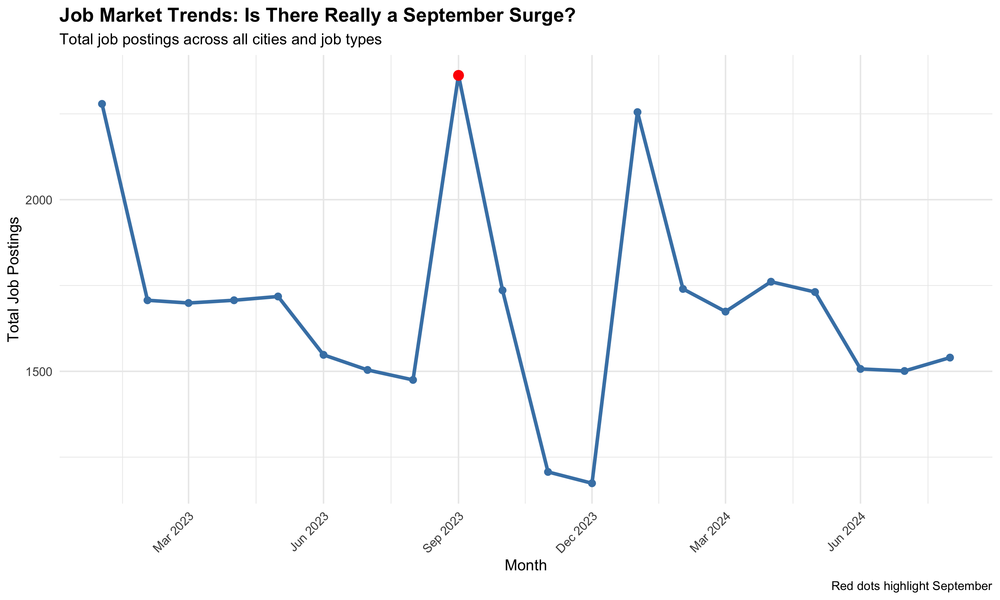
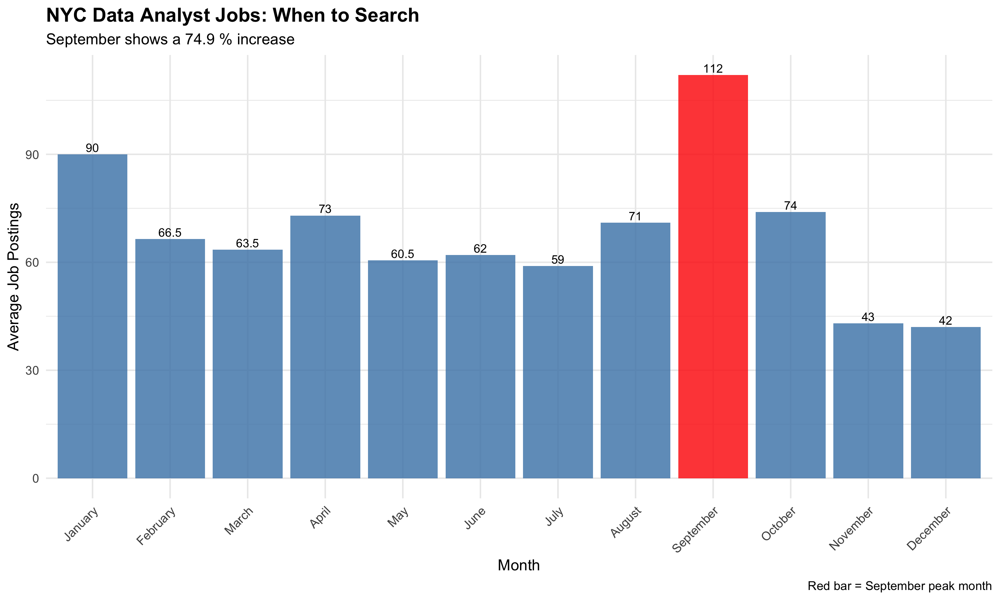

## Job Market Analysis: Data-Driven Career Strategy
**A comprehensive analysis of job market trends to inform job search timing and location decisions.**

### 🎯 Project Overview
As an unemployed professional considering relocation, I used data analysis to answer: Where and when should I focus my job search?

### Key Questions Addressed:
- Is the "September surge" in hiring real?
- Which cities offer the best opportunities for my target roles?
- How should seasonal patterns influence job search timing?
- What job types perform best in different markets?

### 📊 Key Findings
>🔥 September Surge Confirmed
> - 42.6% increase in job postings during September compared to other months
> - January also shows strong hiring activity (secondary peak)
> - Summer and holiday months show significant slowdowns

>🏆 Market Leaders
> - Overall Winner: San Francisco Data Analyst (highest combined score)
> - Northeast Winner: New York Data Analyst (best among target cities)
> - Consistent Pattern: Data Analyst emerged as top job type across ALL target cities

>📅 Optimal Timing Strategy
> - Peak Month: September (~112 NYC Data Analyst jobs expected)
> - Secondary Peak: January
> - Recommendation: Intensive search efforts during September, preparation during August

### 🛠️ Technical Approach

#### Data & Methodology
- Scope: 8 cities × 6 job types × 20 months = 960 data points
- Time Period: January 2023 - August 2024
- Scoring System: Combined job volume and salary metrics (normalized 0-1 scale)
- Cities Analyzed: NYC, Boston, Philadelphia, Chicago, San Francisco, Seattle, Portland, Los Angeles

#### Tools Used
- **R** for data analysis and visualization
- **ggplot2** for data visualization
- **dplyr** for data manipulation
- **Statistical analysis** for seasonal trend testing

---
### 📈 Sample Visualizations

***Monthly Job Posting Trends***

*Clear September spikes visible across the dataset*

---
***NYC Data Analyst Timing Analysis***

*Optimal timing analysis for top target role*

---

### 🎯 Strategic Recommendations
>Primary Strategy
> - Focus: NYC Data Analyst positions
> - Timing: Intensive search in September
> - Rationale: Highest score (0.987) among Northeast target cities

>Backup Strategy
> - Alternative: Boston Data Analyst (score: 0.868)
> - Consideration: San Francisco Data Analyst (highest overall: 0.996)

>Timing Tactics
> - September: Peak hiring month (+42.6% jobs)
> - January: Secondary peak for backup timing
> - Avoid: Summer months and holiday season

### 📁 Repository Structure
job-market-analysis/. 
 data/. 
      raw/                                  # Original datasets. 
      processed/                            # Cleaned, analyzed data. 
  scripts/. 
      01_web_scraping_starter.R             # Initial data collection approach. 
      02_basic_analysis.R                   # Core trend analysis. 
      03_september_timing_analysis.R        # Seasonal timing deep dive. 
      04_detailed_ranking_analysis.R        # Comprehensive city/job comparison. 
      05_final_summary.R                    # Executive summary and recommendations. 
  outputs/. 
      figures/                              # All visualizations. 
  README.md                                 # This file. 

### 🚀 How to Run This Analysis
1. Clone the repository
bashgit clone https://github.com/mixonstudio/job-market-analysis.git
2. Open in RStudio
3. Open job-market-analysis.Rproj
4. Install required packages
rinstall.packages(c("dplyr", "ggplot2", "readr", "lubridate", "tidyr"))
5. Run scripts in order

## 💼 Skills Demonstrated
- Data Analysis: Statistical testing, trend analysis, multi-criteria decision modeling
- R Programming: Data manipulation, visualization, reproducible research
- Business Thinking: Translating personal decisions into analytical frameworks
- Communication: Clear presentation of complex findings with actionable recommendations

## 🔮 Future Enhancements
- Integration with real-time job posting APIs (Indeed, LinkedIn)
- Cost of living adjustments for salary comparisons
- Machine learning models for hiring prediction
- Interactive dashboard for dynamic filtering

#### 📧 Contact
sarah.m.mixon@gmail.com | linkedin.com/in/sarah-mixon | tinyfol.io/nexttinything

>This project demonstrates data analysis capabilities through a real-world problem I was facing. The work showcases skills in R programming, statistical analysis, and translating personal decisions into analytical frameworks.

